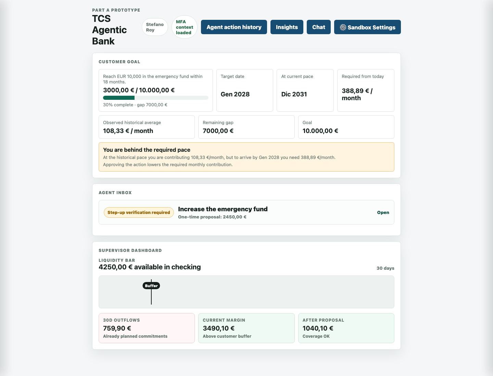

# TCS Agentic Bank

An agentic banking prototype where the assistant can reason over verified customer data, explain a savings recommendation, and request approval before any money movement is committed.



## Experience

The demo focuses on one concrete banking journey: after salary arrives, the app evaluates checking liquidity, upcoming expenses, and the `Emergency_Fund` goal. It then proposes a transfer, shows the projected impact, routes the action through deterministic guardrails, and records the trace.

The interface is designed to make the AI decision inspectable:

- `Customer Goal` shows the savings target, current pace, remaining gap, and monthly contribution needed.
- `Agent Inbox` presents the recommended action and its approval route.
- `Supervisor Dashboard` displays liquidity, known 30-day outflows, and before/after safety margins.
- `Insights`, `Explainability`, and `Proposal impact` expose the evidence behind the recommendation.
- `Chat` answers grounded questions with tool calling when an LLM provider is configured.
- `Sandbox Settings` lets reviewers change balances, expenses, and risk thresholds without touching real systems.

## Architecture

The prototype keeps reasoning, authorization, execution, and audit separate.

- FastAPI serves the API and the static frontend.
- SQLite is the local system of record, seeded from JSON data.
- Deterministic read models calculate balances, cash-flow outlook, goal progress, and proposal impact.
- Pydantic tool schemas validate agent tool arguments.
- Guardrails decide whether a transfer is allowed, approval-gated, step-up-gated, or blocked.
- JSON audit logs preserve local demo traces for review.

The dashboard, proposal flow, guardrails, and transfer execution work without external services. The chat experience needs one configured LLM key in `.env` or the shell environment:

```bash
GROQ_API_KEY=""
OPENAI_API_KEY=""
GEMINI_API_KEY=""
```

Only one key is required; if more than one is present, the backend auto-selects and falls back across configured providers.

## Quick Start

Use the `Makefile` as the operational entry point.

Recommended first run from a clean machine:

```bash
python3 -m venv .venv
source .venv/bin/activate
make setup
make run
```

Python 3.11 is recommended for the demo environment.

Then open:

```text
http://127.0.0.1:8000
```

For later runs, activate the same virtual environment and start the app:

```bash
source .venv/bin/activate
make run
```

If your Python environment already has the dependencies installed, `make run` is enough. The `setup` target simply runs `pip install -r requirements.txt` in the active Python environment; it does not create a virtual environment for you.

The Makefile uses the active Python interpreter for both installation and startup (`python3 -m uvicorn`). If `make run` reports missing dependencies, run `make setup` in the same activated environment and then retry `make run`.

Useful commands:

```bash
make help
```

The Makefile contains setup, run, dev, smoke-test, reset, docs, stop, restart, compile, and clean commands.

LLM configuration is optional. Without an API key, the dashboard, proposal flow, guardrails, approval, execution, and audit trail still work; only the contextual chat reports that the AI assistant is unavailable.

## Try This

- Approve the proposed transfer toward `Emergency_Fund`.
- Change the proposal amount and preview the updated route.
- Set the amount to EUR 750 to trigger the step-up path.
- Open `Insights` to inspect historical balances and spending used for grounding.
- Open `Explainability` and `Proposal impact` from the inbox.
- Ask the chat: `How much have I spent on sports recently?`
- Ask the chat: `Can you tell me the risk of my mortgage?`

## Documentation

Submission material lives in `docs/`:

- `part_B-architecture_system_design.md`
- `part_B-architecture_system_design.html`
- `part_C-process_decision.md`
- `part_C-process_decision.html`

## Code Map

- `src/backend/api_server.py`: FastAPI routes and frontend mount.
- `src/backend/banking_demo_application.py`: application wiring and use cases.
- `src/backend/storage/`: SQLite schema, seed, reads, writes, reset, and idempotency.
- `src/backend/intelligence/`: deterministic planning, cash-flow math, read models, and proposal explainability.
- `src/backend/application/`: dashboard state, chat service, approval workflow, audit, and environment helpers.
- `src/backend/agentic_system/`: LLM orchestration, tools, schemas, retrieval, provider selection, and guardrails.
- `src/frontend/`: static HTML, CSS, and JavaScript UI.
