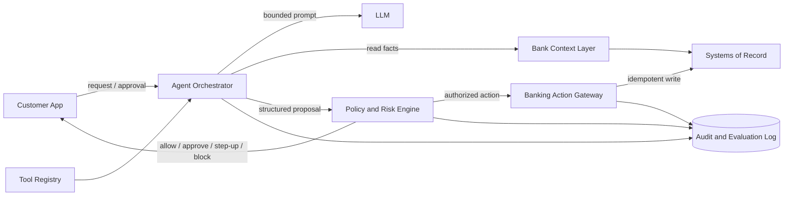
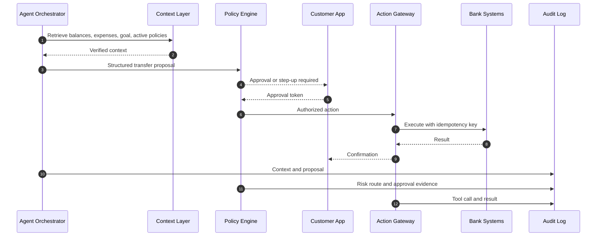

# Part B - Architecture and System Design

## Agentic Banking Experience

The prototype explores a banking app where the AI agent becomes the customer's primary interface, but not the direct authority over money. The demonstrated flow is narrow on purpose: after salary arrives, the agent detects idle liquidity, checks known expenses and the `Emergency_Fund` goal, proposes a transfer, asks for approval, executes only after authorization, and records the trace.

The production design is built around one principle: **separate reasoning from control**. The model can interpret intent, retrieve context, and explain a proposed action. Deterministic services decide whether that action is allowed, requires approval, needs MFA, requires co-approval, or must be blocked.

## Reference Architecture

The customer app shows the recommendation, the financial impact, the reason approval is needed, and the final outcome. The agent orchestrator owns conversation flow and tool selection, but it does not write to bank systems. The context layer exposes verified balances, transactions, goals, beneficiaries, and active policies. The policy engine owns risk routing. The banking gateway is the only component allowed to execute writes, and only with a validated action, approval token, and idempotency key.

This keeps the line clear for both business and engineering: the AI improves experience and decision support; bank controls remain explicit, testable, and auditable.

## Interaction and Autonomy

Autonomy changes with risk. For read-only questions, the agent can answer after grounding in verified data. For low-risk reversible tasks, such as categorization, execution may be allowed if the customer has enabled it. For money movement to an existing internal destination, the default route is customer approval. For high-value transfers, new beneficiaries, shared accounts, credit products, or irreversible changes, the route becomes MFA, co-approval, human review, or block.

Risk is not only amount. The engine also considers destination, reversibility, ownership, customer preferences, data freshness, account type, and policy version. A small transfer into an existing savings pot is not treated like a mortgage application or a new external payee.

## Grounding and Data Boundaries

Current financial facts must come from systems of record or structured read models, not from model memory or chat history. RAG is useful for policies, procedures, and product explanations, but it should not be the source of balances, amounts, or execution state.

The orchestrator gives the model a small, typed context package: available balance, upcoming expenses, savings goal, allowed tools, active policy snippets, and instruction constraints such as "propose at most one action" and "do not invent missing facts." The audit trace stores the context references, policy versions, proposal, approval decision, tool call, and result. If a fact is missing or stale, the agent must say so or defer; it should not fill gaps with plausible financial advice.

## Taking Action Safely

Every capability is added through a tool contract, not a prompt permission. A tool declares its input schema, risk class, dry-run support, reversibility, required approvals, idempotency behavior, and audit fields. The agent can discover available tools, but the policy engine decides whether a proposed use is allowed.

Adding a new capability, for example card freeze or bill payment, requires an adapter, a typed tool schema, policy rules, UI states, audit fields, and evaluation cases. It should not require rewriting the agent loop.

## Reliability, Safety, and Operations

The system fails conservatively. If the model times out, no action is executed. If context is missing, the answer is limited. If retrieval is uncertain, the policy is not treated as fact. If the policy engine is unavailable, writes fail closed. If core banking times out, retries use the same idempotency key to prevent duplicate movement.

Operationally, I would track grounded-answer rate, verifier pass rate, false allow rate, blocked-action rate, approval and rejection rates, p95 latency, fallback rate, cost per flow, and post-action disputes. Before expanding autonomy, each model, prompt, and tool should pass offline evaluation, adversarial cases, replay on anonymized historical data, shadow mode, and staged rollout.

## Enterprise and Regulatory Reality

Auditability is a product feature, not just compliance plumbing. Customers need a readable explanation of what data was used and what was approved. Operations and compliance need a reconstructable trace with prompt inputs, policy versions, approval evidence, tool calls, and outcomes.

Privacy controls should minimize what reaches the model, redact unnecessary fields, isolate tenant and customer data, and keep secrets out of prompts. Authentication for agent-initiated actions should use normal bank-grade approval tokens. Shared accounts require explicit policy for who can view, approve, set autonomy preferences, and veto actions; conflicts should choose the most conservative route.

The result is not a chatbot attached to banking APIs. It is an agentic banking system where reasoning, authorization, execution, and audit have separate owners.
