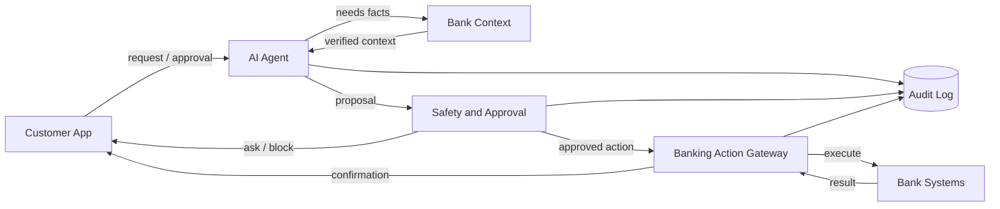
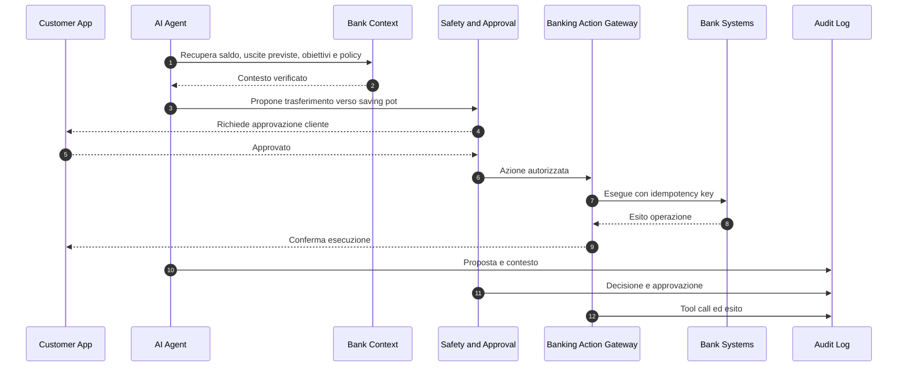
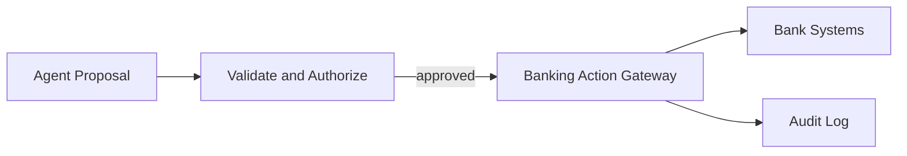
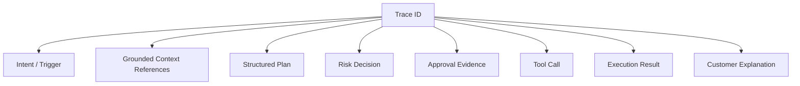

# Parte B - Architettura e System Design

## Agentic Banking Experience

Il prototipo dimostra una banking app in cui un agente AI diventa l'interfaccia primaria per il cliente, senza diventare autorità diretta sui sistemi core della banca.

Flow dimostrato: dopo l'arrivo dello stipendio, l'agente rileva liquidità inattiva, controlla uscite previste e obiettivo `Emergency_Fund`, propone un trasferimento, chiede approvazione, simula l'esecuzione e registra l'audit trail.

La scelta architetturale centrale è separare il "pensare" dal "fare": il modello può ragionare e proporre; autorizzazione, policy ed esecuzione restano deterministiche, testabili e auditabili.

## 1. Obiettivi di design

| Obiettivo | Significato |
|---|---|
| Accuratezza | I fatti finanziari arrivano dai systems of record, non dalla memoria del modello. |
| Controllo | L'agente usa solo tool registrati, tipizzati e autorizzati. |
| Sicurezza | Un layer deterministico decide allow, approval, step-up o block. |
| Auditability | Proposte, decisioni, approvazioni, tool call ed esiti sono ricostruibili. |
| Evolvibilità | Nuove capability si aggiungono via registry e policy, non riscrivendo l'agente. |

## 2. Architettura di riferimento



| Blocco | Responsabilità |
|---|---|
| `Customer App` | Esperienza cliente, approvazioni, spiegazioni, fonti e audit leggibile. |
| `AI Agent` | Interpreta l'intento, usa contesto verificato e produce una proposta strutturata. |
| `Bank Context` | Espone dati cliente, read model e policy versionate. |
| `Safety and Approval` | Valuta rischio, soglie, step-up, co-approvazione e blocchi. |
| `Banking Action Gateway` | Esegue solo azioni validate e autorizzate, con idempotenza. |
| `Bank Systems` | Systems of record: core banking, ledger, payments, cards, customer data. |
| `Audit Log` | Trace immutabile per customer explanation, operations ed evaluation. |

Il confine critico è tra `Safety and Approval` e `Banking Action Gateway`: nessuna azione con effetti reali raggiunge i sistemi bancari senza verifica e autorizzazione.

## 3. Runtime flow



Lo stesso pattern copre altre capability: blocco carta, annullamento abbonamento, pagamento fattura o modifica budget cambiano tool e policy, non architettura.

## 4. Autonomia e controllo umano

| Livello | Tipo di azione | Esempio | Route |
|---|---|---|---|
| 0 | Informativa | "Quanto ho speso in sport?" | Risposta grounded. |
| 1 | Basso rischio e reversibile | Ricategorizzare una transazione | Esegue se la policy cliente lo consente. |
| 2 | Medio rischio | Spostare una piccola somma verso saving pot esistente | Chiede approvazione. |
| 3 | Alto rischio, nuovo o irreversibile | Nuovo beneficiario, importo elevato, chiusura conto | Step-up, co-approval o human-only. |

Il rischio non è solo importo. Il policy engine considera reversibilità, pattern storici, destinazione, account ownership, preferenze cliente, classe del tool e freschezza dei dati.

## 5. Grounding

| Tipo di dato | Fonte | Uso |
|---|---|---|
| Saldi, transazioni, pending, obiettivi, beneficiari | API bancarie e read model strutturati | Fonte di verità per numeri e stato operativo. |
| Policy, procedure, prodotti, vincoli interni | Repository documentali versionati | Retrieval semantico e spiegazioni operative. |

Il RAG è utile per policy e knowledge base. Non deve essere fonte per saldi, importi o stato di esecuzione.

L'orchestratore passa al modello un contesto minimo:

```json
{
  "customer_context": {
    "available_balance": 4250.0,
    "currency": "EUR",
    "upcoming_expenses_30d": 1520.0,
    "emergency_fund": {"target": 10000.0, "current": 3000.0},
    "autonomy_preferences": {
      "savings_transfer_requires_approval_above": 100.0
    }
  },
  "allowed_tools": ["transfer_to_savings_pot"],
  "instruction": "Propose at most one action. Do not invent missing facts."
}
```

L'audit conserva query dati, versioni documentali e input effettivo usato per la proposta.

## 6. Tool registry ed esecuzione

Ogni tool dichiara schema, risk class, reversibilità, dry-run, idempotenza e approval policy.

```json
{
  "name": "transfer_to_savings_pot",
  "input_schema": {
    "source_account_id": "string",
    "target_pot_id": "string",
    "amount": "decimal",
    "currency": "EUR",
    "reason": "string"
  },
  "risk_class": "medium",
  "reversible": true,
  "supports_dry_run": true,
  "idempotency_required": true,
  "approval_policy": "decided_by_policy_engine"
}
```



Per aggiungere una capability servono adapter, contratto tool, policy, stati UI, audit schema ed eval cases. L'agente scopre vincoli e tool dal registry.

## 7. Policy and Risk Engine

Il risk engine riceve input strutturati e restituisce una route spiegabile:

```json
{
  "action": "transfer_to_savings_pot",
  "amount": 300.0,
  "risk_class": "medium",
  "reversible": true,
  "is_existing_target": true,
  "customer_preference": "approval_required_above_100",
  "route": "ask_approval",
  "reason_codes": [
    "amount_above_customer_autonomy_limit",
    "money_movement",
    "reversible_action"
  ]
}
```

La route controlla sia il backend sia la UI: allow, approval, step-up, co-approval, block o human review.

## 8. Auditability ed explainability



Il cliente vede dati usati, impatto previsto, motivo dell'approvazione ed esito. Engineering e operations vedono il trace completo. La domanda "perché l'agente ha fatto questo?" deve essere rispondibile dal trace, non dal modello a posteriori.

## 9. Reliability, safety e operations

Il sistema fallisce in modo conservativo.

| Failure mode | Comportamento |
|---|---|
| Timeout modello | Fallback; nessuna esecuzione. |
| Dati finanziari mancanti | Non inventa numeri; chiede conferma o rimanda. |
| Retrieval incerto | Non cita policy come fatto certo; escalation se necessario. |
| Verifier mismatch | Blocca prima di approval o execution. |
| Risk engine non disponibile | Fail closed. |
| Approval scaduta | Richiede nuovo approval token. |
| Timeout core banking | Retry solo con idempotency key; stato pending se serve. |
| Richiesta duplicata | Idempotenza contro doppia esecuzione. |

Metriche operative: grounded answer rate, tool accuracy, verifier pass rate, blocked action rate, false allow rate, approval/rejection rate, p95 latency, fallback rate e cost per flow.

Prima di dare autorità a un nuovo prompt, modello o tool: offline eval, casi avversariali, replay storico anonimizzato, shadow mode e rollout graduale.

## 10. Privacy, autenticazione e conti condivisi

Privacy: minimizzare il contesto passato al modello, redigere campi non necessari, isolare tenant e cliente, tenere secret fuori dal prompt e centralizzare le chiamate modello.

Autenticazione: se la route è `step_up_required`, il gateway richiede un approval token valido prima di qualsiasi write.

Conti condivisi: il policy engine deve modellare chi può vedere, approvare, impostare preferenze di autonomia e quando serve co-approvazione. In caso di conflitto sceglie la route più conservativa.

## 11. Roadmap di produzione

| Stage | Scope | Scopo |
|---|---|---|
| Prototype | Seed mock, SQLite locale, audit panel | Dimostrare interaction model e control model. |
| MVP 1 | Read-only e propose-only | Valore cliente senza autorità di esecuzione. |
| MVP 2 | Azioni reversibili a basso rischio | Validare registry, policy, audit e rollback. |
| MVP 3 | Money movement verso destinazioni fidate | Introdurre approval, step-up e gateway bancario. |
| Production scale | Più tool, shared accounts, ops console, eval pipeline | Espandere senza cambiare il core design. |

La prima capability reale non dovrebbe essere un "autonomous banker" generico. Partirei da insight di cash-flow e raccomandazioni di risparmio, con esecuzione disabilitata o sempre approval-gated.

